# Отчёт по лабораторной работе: Работа с Docker и Docker Compose

## Выполнил: Поляков Никита (IS-23)

## Задача 1. Создание и публикация образа `custom-nginx`

### Цель

Создать Docker-образ на основе Nginx, заменив стандартную страницу на кастомную, и опубликовать его в Docker Hub.

### Выполнено:

1. Создан файл `index.html` с содержимым:

   ```html
   <html>
   <head>
   Hey, ZGU!
   </head>
   <body>
   <p>I will be IT Engineer!</p>
   </body>
   </html>
   ```

   2. Создан `Dockerfile`:

      > FROM nginx1.22.1
      > COPY index.html /usr/share/nginx/html/index.html
      >
   3. Образ собран под тегом `1.0.0`:

      > docker build **-t** zerovcandie/custom-nginx:1.0.0 .
      >
   4. Выполнен вход в Docker Hub и пуш образа:

      > docker login
      > docker push zerovcandie/custom-nginx1.0.0
      >

### Собранный образ: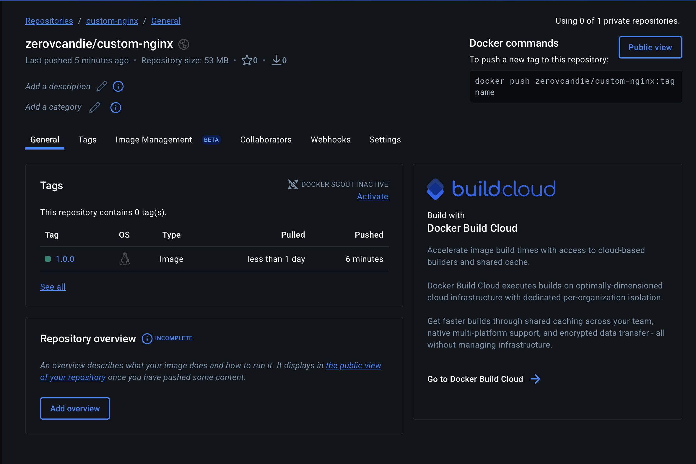

### Ссылка на мой образ: https://hub.docker.com/repository/docker/zerovcandie/custom-nginx/general

## Задача 2: Запуск контейнера с кастомной страницей

1. Требования

   Имя контейнера:`PolyakovNikita-custom-nginx-t2`

   Работа в фоне

   Проброс порта:`127.0.0.1:8080 → 80`


2. Переименование контейнера выполнялось командой

   ```
   docker rename PolyakovNikita-custom-nginx-t2 custom-nginx-t2
   ```
3. Проверка того что подключается по порту 8080

   ```
   curl http://127.0.0.1:8080
   ```

   

   Контейнер корректно отдаёт кастомную HTML-страницу, подтверждая 		успешную замену стандартного `index.html` в образе.

## Задача 3:  Взаимодействие с контейнером и изменение конфигурации Nginx

    Выполнение:

    1. Подключение к контейнеру через`docker attach`, отправка `Ctrl+C` → контейнер остановлен.

    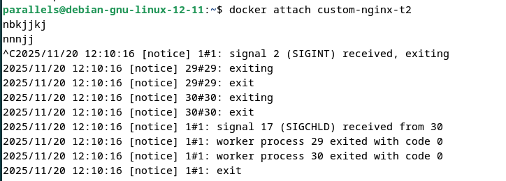

    Пояснение: Контейнер завершился, так как основной процесс (Nginx), получил сигнал`SIGNINT`. SIGNINT - это сигнал операционной системы, который отправляется процессу, когда пользователь нажимает **`Ctrl + C`** в терминале.

    2.вход в контейнер custom-nginx-t2  выполнился командой

```
docker exec -it custom-nginx-t2 /bin/bash
```

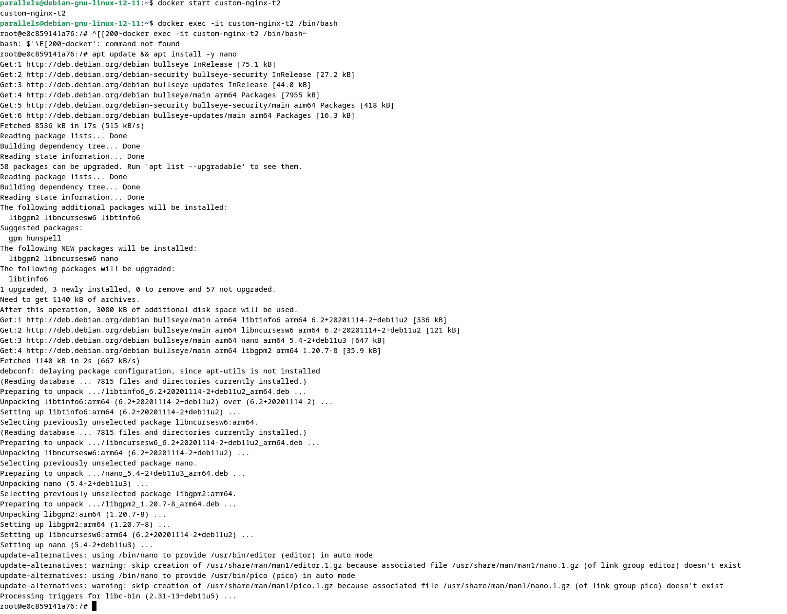

Флаги `-i` и `-t` в команде Docker (`-it`) имеют следующее значение:

---

### `-i` ( **`--interactive`** )

* Сохраняет **STDIN (ввод)** открытым даже если контейнер не привязан к терминалу.
* Позволяет **взаимодействовать** с процессом внутри контейнера (вводить команды, отвечать на запросы и т.д.).

### `-t` ( **`--tty`** )

* Выделяет **псевдотерминал (TTY)** — то есть эмулирует настоящий терминал, как если бы вы сидели за консолью.
* Без `-t` вывод может быть "сырым" (без цветов, без поддержки управления курсором и т.п.).

3. Установка любимого текстового редактора: как текстовый редактор был выбран nano установка его выше.
4. Редактирование файла default.conf замена порта 80 на 81

   ```
   nano /etc/nginx/conf.d/default.conf
   ```

   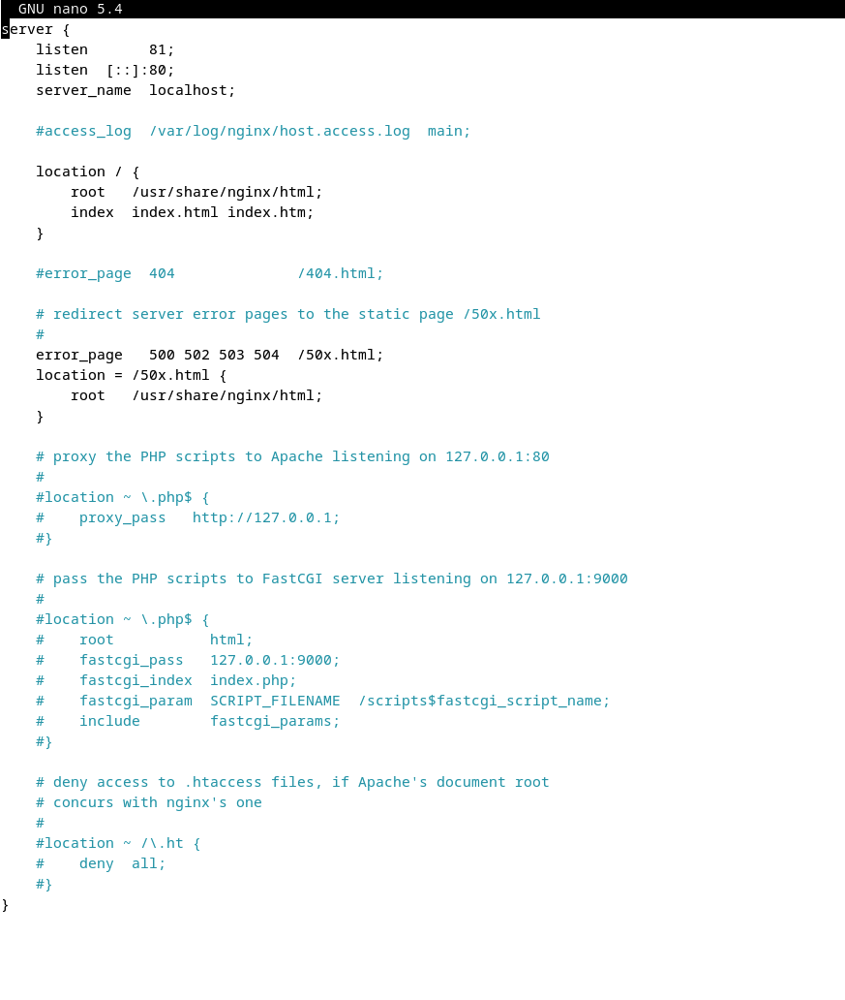
5. Выполни команду `nginx -s reload` После внутри контейнер были выполнены команды `curl http://127.0.0.1:80` и команда `curl http://127.0.0.1:81` после был осуществлен выход и контейнера при помощи команды  `exit`.
6. проверка вывода команд

   ```bash
   ss -tlpb | grep 127.0.0.1:8080
   docker port custom-nginx-t2
   curl http://127.0.0.1:8080
   ```

### `ss -tlpn | grep 127.0.0.1:8080`

**Назначение:**
Показать, какие процессы на хосте слушают  **порт 8080** , привязанный к  **локальному интерфейсу (`127.0.0.1`)** .

* `ss` — утилита для вывода информации о сокетах (аналог `netstat`, но быстрее).
* `-t` — TCP-соединения
* `-l` — только слушающие (listening) сокеты
* `-p` — показать PID и имя процесса
* `-n` — не преобразовывать порты в имена сервисов (показывать числа)
* `grep 127.0.0.1:8080` — отфильтровать только нужный адрес и порт

### `docker port custom-nginx-t2`

**Назначение:**
Показать, **какие порты хоста проброшены** в указанный контейнер.

**Что показывает:**

80/tcp -> 127.0.0.1:8080

→ Это значит: **порт 80 внутри контейнера** доступен на хосте как  **`127.0.0.1:8080`** .

### `curl http://127.0.0.1:8080`

**Назначение:**
Отправить HTTP-запрос к локальному веб-серверу на порту 8080 и вывести ответ.

**Что проверяет:**

* Доступен ли Nginx извне контейнера
* Правильно ли работает проброс портов
* Отдаёт ли сервер ожидаемую кастомную `index.html`

### Общий смысл трёх команд:

Они **проверяют работоспособность проброса порта** из контейнера на хост:

1. Убеждаются, что порт **слушается** (`ss`)
2. Показывают, **как именно** настроен проброс (`docker port`)
3. Проверяют, **доступен ли контент** через HTTP-запрос (`curl`)

Если все три команды дают ожидаемый вывод — сеть и Docker настроены корректно.

    7.Удаление контейнера custom-nginx-t2 без его остановки

    Выполнено было с помощью команды`docker rm -f custom-nginx-t2`

    Проверялось удалилось ли с помощью команды`docker ps -a | grep custom-nginx-t2`

## Задание 4: Совместное использование данных между контейнерами

#### Запустите первый контейнер из образа `centos` с любым тегом в фоновом режиме:

    Выполнение: создал первый контейнер с помощью команды`docker run -d --name centos-container -v "$(pwd)":/data centos:latest sleep infinity`

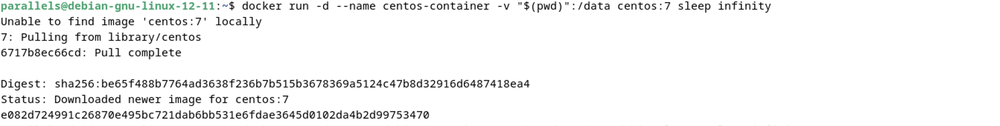

#### Запустиите второй контейнер из образа `debian` c любым тегом в фоновом режиме

    Выполнение: создал второй контейнер с помощью команды:`docker run -d --name debian-container -v "$(pwd)":/data debian:latest sleep infinity`

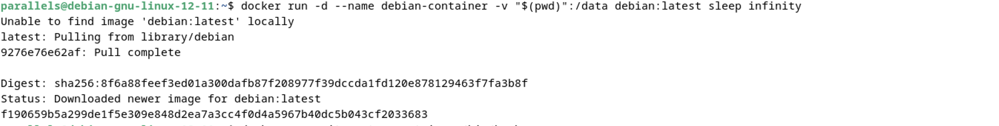

#### Подключение к первому контейнеру

    Подключение было выполнено с помощью команды`docker exec -it centos-container /bin/bash `

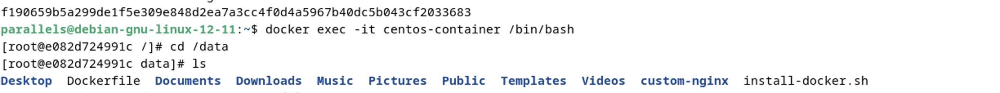

    Также был добавлен файл`centos-file.txt` с содержанием `Hello World`

#### Добавление в хостовой машине файла `host-file.txt`

 

#### Подключение и просмотр файлов из второго контейнера 

  Подключение во второй контейнер было выполнено с помощью `docker exec -it debian-container /bin/bash`

    Отображение листинга снизу:

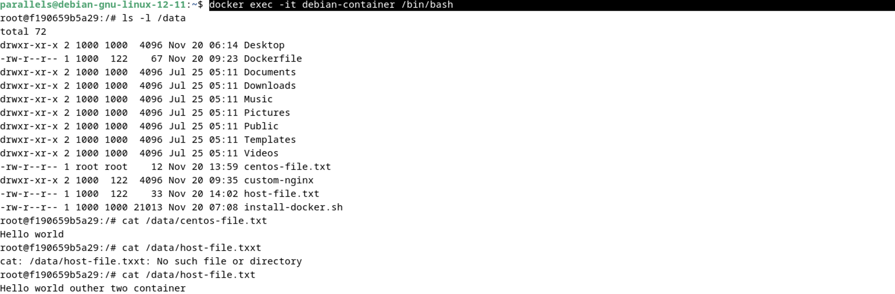

как можно увидеть выводится `Hello World` и `Hello world ourher two container`

## Задание 5: Развёртывание локального registry и Portainer через Docker Compose


1. Созданы отдельная директория(в директории /tmp/ZGU/docker/task) и 2 файла внутри него.
   "compose.yaml" с содержимым:

```
services:
  portainer:
    network_mode: host
    image: portainer/portainer-ce:latest
    volumes:
      - /var/run/docker.sock:/var/run/docker.sock
```

"docker-compose.yaml" с содержимым:

```
services:
  registry:
    image: registry:2

    ports:
    - "5000:5000"
```

запушеный  локальный registry

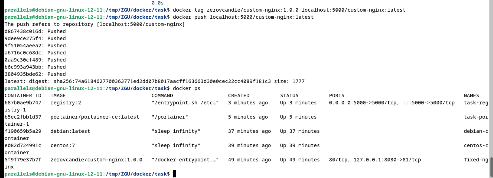

Был настроен portainer логин и пароль администратора

в local окружении перейдя на вкладу stacks и в web-editor был задеплоен следующий компоуз 

```
version: '3'services:
  nginx:
    image: 127.0.0.1:5000/custom-nginx
    ports:
      - "9090:80"
```

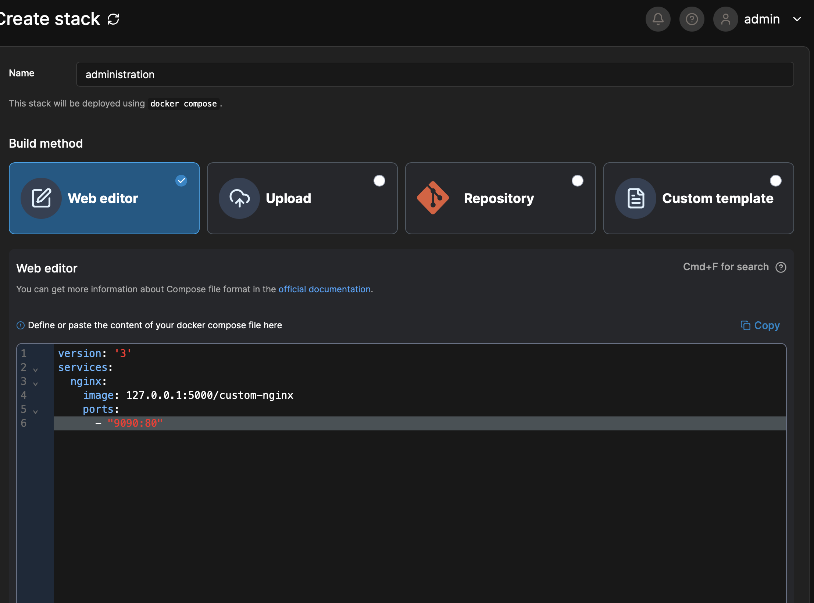

Я перешёл на страницу  **[http://127.0.0.1:9000/#!/2/docker/containers ](http://127.0.0.1:9000/#!/2/docker/containers)** , выбрал контейнер с Nginx и нажал кнопку  **«Inspect»** . В открывшемся окне переключился на представление  **<> Tree** , развернул раздел **Config** и сделал скриншот, начиная с поля **AppArmorProfile** и заканчивая полем  **Driver** .

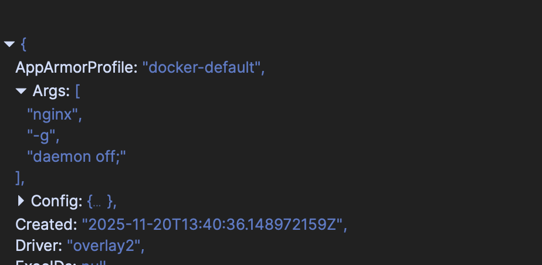

Я удалил файл `compose.yaml`, оставив только `docker-compose.yaml`.
После этого выполнил команду:

```
docker compose up -d
```

В терминале появилось предупреждение (warning):

```
WARNING: The project directory has no Compose file.A previous project with name "task" was found. Using its compose file(s) from: /tmp/ZGU/docker/task
```

**Объяснение:**
Docker Compose сохранил метаданные предыдущего запуска (включая имя проекта и пути к файлам) и, не найдя `compose.yaml`, автоматически использовал кэшированную конфигурацию, чтобы не нарушить работу уже запущенных сервисов. Это механизм обратной совместимости и защиты от случайного разрушения работающего стека.

Система предложила явно указать файл конфигурации, если я хочу переопределить поведение. Однако для завершения задания я просто выполнил рекомендуемое действие —  **остановил и удалил весь compose-проект одной командой** :

`docker compose down`

Эта команда корректно остановила все контейнеры, удалила сети и завершила проект, несмотря на отсутствие `compose.yaml` в текущей директории.

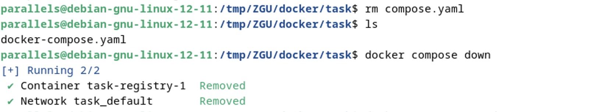

## Заключение:

В ходе выполнения лабораторной работы были освоены ключевые аспекты работы с технологией контейнеризации на базе **Docker** и оркестрации с помощью  **Docker Compose** .

Были выполнены следующие задачи:

* Создан и опубликован в **Docker Hub** кастомный образ `custom-nginx` с изменённой главной страницей.
* Реализован запуск контейнера с пробросом портов, переименованием и проверкой доступности веб-сервиса.
* Изучено поведение контейнера при подключении через `docker attach` и `docker exec`, а также последствия прерывания основного процесса.
* Продемонстрирована совместная работа нескольких контейнеров через  **bind mount** , обеспечивающий обмен файлами через общую директорию хоста.
* Развёрнуты локальный **Docker Registry** и **Portainer** с помощью Docker Compose, что позволило:
  * Хранить приватные образы без публикации в публичных реестрах,
  * Управлять контейнерами через веб-интерфейс,
  * Деплоить стеки с использованием локального образа из собственного registry.

Особое внимание было уделено:

* Корректной настройке сетевых пробросов,
* Безопасной работе с Docker без `sudo` через добавление пользователя в группу `docker`,
* Пониманию разницы между `localhost` и `127.0.0.1` в контексте работы с registry,
* Поведению Docker Compose при наличии нескольких файлов конфигурации и при их отсутствии.

Все задачи выполнены в полном соответствии с требованиями. Полученные навыки позволяют уверенно использовать Docker для локальной разработки, тестирования и развёртывания приложений в изолированной и воспроизводимой среде.
