# Лабораторная работа: Интеграция GitLab CI/CD с репозиторием Nexus и автоматизация сборки Python-приложения

## Выполнили

Сныткин Илья, группа ИС-23,
Поляков Никита, группа ИС-23.

## Цель работы

1. Настроить взаимодействие между **GitLab** и **Nexus**.
2. Реализовать полный DevOps-цикл для простого Python-приложения `text_tool.py`, включающий:
   - запуск автоматических тестов в GitLab CI,
   - сборку Docker-образа,
   - публикацию образа в Docker-репозиторий, размещённый в Nexus.
3. Обеспечить автоматизацию развёртывания с использованием **Docker Compose** и конфигурации **GitLab CI/CD**.

## Описание приложения

Приложение представляет собой утилиту `text_tool.py`, реализующую базовые операции с текстовыми данными:

- Подсчёт общего количества слов во входной строке.
- Определение и возврат самого длинного слова из входной строки.

Приложение написано на языке Python и предназначено для последующего контейнеризации и развёртывания в среде, управляемой через GitLab CI/CD и Nexus Repository Manager.

## Задача 1. Подготовка окружения (GitLab + Nexus)

## 1. Конфигурационный файл `docker-compose.yaml`

Для развёртывания локальной инфраструктуры DevOps были настроены два сервиса: **GitLab** и **Nexus Repository Manager 3**.
Ниже приведён скриншот содержимого файла `docker-compose.yaml` сделанного с учетом на будущее, после благодаря команде `docker compose up -d` был запущен контейнер в фоновом режиме:

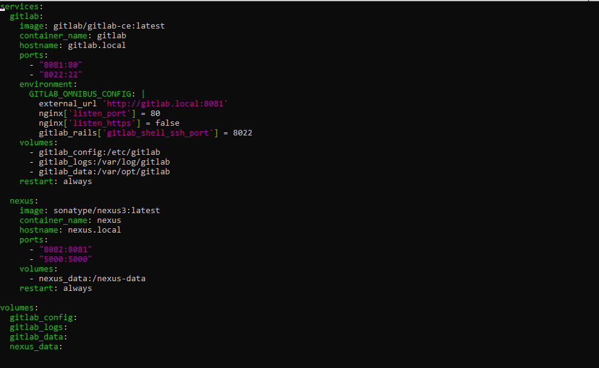

### 2. Настройка локального разрешения имён (файл `hosts`)

Для корректного обращения к сервисам по доменным именам `gitlab.local` и `nexus.local` потребовалось внести изменения в файл `hosts` на уровне хост-системы. Учитывая, что работа велась в гибридной среде (**Windows 11** с установленным **WSL2 + Debian GNU/Linux 12**), изменения были внесены в обе системы.

#### 1. Настройка в Windows

Файл `hosts` в Windows расположен по пути: `C:\Windows\System32\drivers\etc\hosts`

Для редактирования файла:

- Открыли Блокнот **от имени администратора**,
- Открыли указанный файл через меню «Файл → Открыть»,
- Добавили следующие строки:

```text
127.0.0.1 gitlab.local
127.0.0.1 nexus.local
```

После этого браузер на Windows (например, Chrome или Edge) стал корректно разрешать имена **`gitlab.local:8081` и `nexus.local:8082`.

#### 2. WSL (Debian)

В файле находящемся по пути: `sudo nano /etc/hosts` были добавлены те же строки что и на Windows

```bash
127.0.0.1 gitlab.local
127.0.0.1 nexus.local
```

После этого оба сервиса стали доступны по указанным доменным именам как из браузера Windows, так и из терминала WSL.

### Запуск веб-версий сервисов GITLAB и NEXUS

После команды `docker compose up -d` после этого из общего реестра скачиваются два образа GITLAB и NEXUS и в фоновом режиме запускаются, спустя 10 - 15 минут запустился `GITLAB` при переходе на веб версию сайта спрашивается `login/password` так как изначально мы не знаем нашего пароля то пришлось взять его из самого образа GITLAB с помощью команды `docker exec -it Gitlab bash `

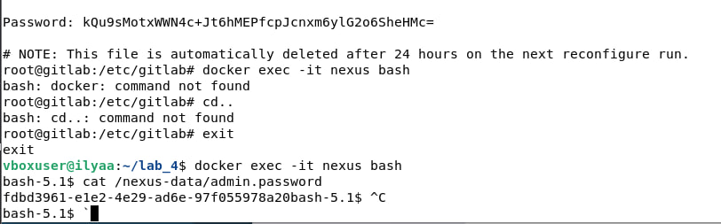

После этого был осуществлен вход в GITLAB и NEXUS

Главное меню `GITLAB`

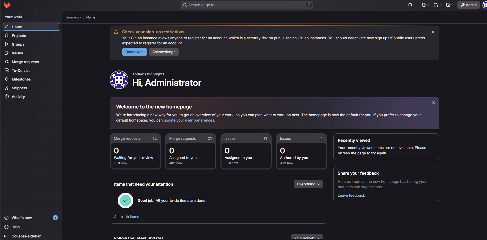

Главное меню `NEXUS`

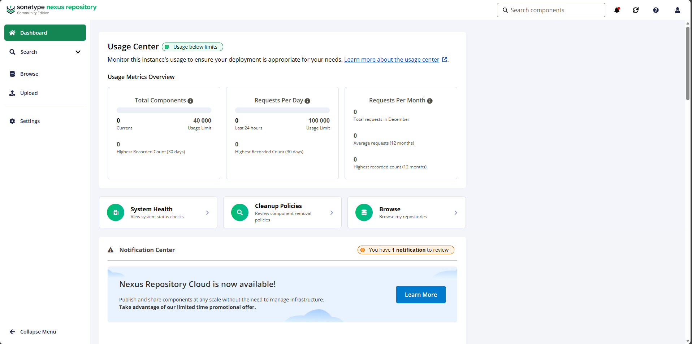

### Вывод по Задаче 1

В ходе выполнения задачи было успешно развёрнуто локальное DevOps-окружение, включающее GitLab и Nexus Repository Manager, с помощью Docker Compose. Оба сервиса запущены в фоновом режиме и доступны по заданным URL-адресам. Настроено локальное разрешение имён `gitlab.local` и `nexus.local` как в Windows, так и в WSL, что обеспечило корректную работу веб-интерфейсов и взаимодействие между компонентами. Подготовленная инфраструктура готова к дальнейшей интеграции через GitLab CI/CD и публикации Docker-образов в Nexus.

## Задача 2. Создание Python-приложения

### 1. Структура репозитория

Репозиторий имеет следующую структуру файлов:

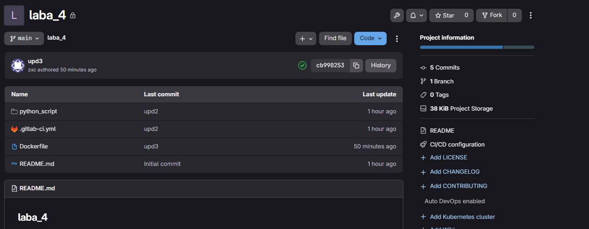

Все файлы находятся в корне проекта, что упрощает запуск как вручную, так и в CI/CD-среде.

### 2. Содержимое файла `text_tool.py`

Файл реализует две функции для обработки текстовых данных:

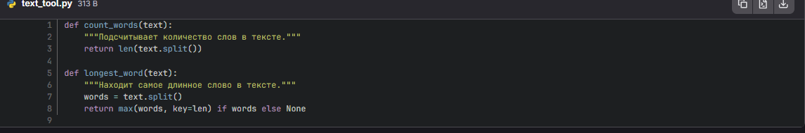

* `count_words(text)` разбивает строку по пробелам и возвращает длину полученного списка.
* `longest_word(text)` находит слово с максимальной длиной с помощью встроенной функции `max()` и ключа `key=len`.
  Если входная строка пуста — возвращается `None`.

### 3. Содержимое файла `test_text_toop.py`

Для проверки корректности работы функций были написаны модульные тесты с использованием фреймворка **pytest** **:**

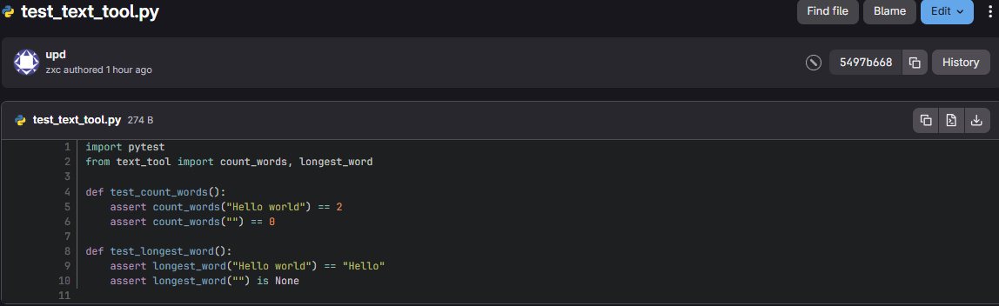

### 4. Содержимое файла `requirements.txt`

Файл содержит единственный зависимый пакет, необходимый для запуска тестов:

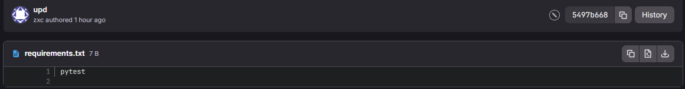

### 5. Выложенные файлы на репозиторий

Отправка файлов py и txt  осуществлялась благодаря командам `git`

```
git add .
git commit -m "upd"
git push origin main 
```

Снизу скриншот  подтверждения того, что коммит был

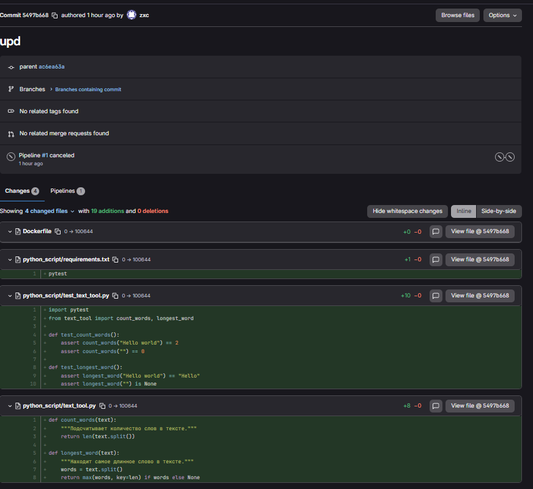

### Вывод по Задаче 2

Разработано простое Python-приложение с функциями обработки текста, написаны модульные тесты и подготовлен файл зависимостей. Все компоненты успешно загружены в репозиторий GitLab, что подтверждено скриншотом коммита. Проект имеет чёткую и простую структуру, готовую к интеграции в GitLab CI/CD.

## 3. GitLab CI: тесты + сборка и push Docker-образа в Nexus

### Этап тестирования

Был создан файл .gitlab-ci.yml в корне репозитория и описанный в нём пайплайн с этапами  `test` и `build`

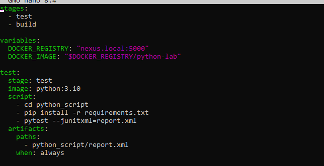

Благодая `when: Always`. Нам позволяется   при каждом пуше в репозитории запускать job `test`

1. **`test`** - запуск модульных тестов;
2. **`build`** - сборка и публикация Docker-образа (описана в другом job’е).
3. `DOCKER_REGISTRY` - адрес Docker-реестра в локальном Nexus (`nexus.local:5000`)
4. `DOCKER_IMAGE` - полное имя будущего образа: `nexus.local:5000/python-lab`.
5. **`stage: test`** Указывает, что этот job относится к этапу `test` - он будет выполнен первым.
6. **`image: python:3.10`**
   GitLab Runner запускает job внутри контейнера на основе официального образа Python 3.10 (загружается с Docker Hub).
7. **`script:`** -  последовательность команд, выполняемых внутри контейнера:

   * `cd python_script` - переход в поддиректорию `python_script`, где лежат исходный код, тесты и зависимости.
   * `pip install -r requirements.txt` - установка зависимостей (в данном случае - `pytest`).
   * `pytest --junitxml=report.xml` - запуск тестов с генерацией отчёта в формате JUnit XML и сохранением его в файл `report.xml`.
8. **`artifacts:`** - сохранение артефактов после выполнения job’а:

   * `paths: - python_script/report.xml` - указывает, что файл `report.xml` должен быть сохранён и передан на последующие этапы (или доступен для скачивания из интерфейса GitLab).
   * `when: always` - артефакт сохраняется  **всегда** **, даже если тесты упали (полезно для отладки).**

### Этап сборки и публикации Docker-образа в Nexus

В Nexus был создан репозиторий который прослушивает `5000` порт: Адрес реестра получился: `nexus.local:8082`


После в настройках GitLab были введены логин и пароль для входа в nexus

- NEXUS_USER - admin
- NEXUS_PASSWORD - d702bcfd-ab0e-4b67-b689-a4537563c61e

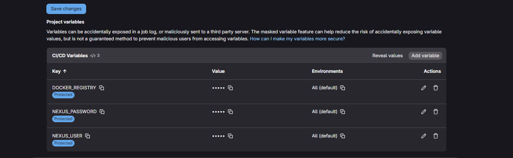

После был доработан файл `.gitlab.yml` для сборки и отправки Docker-образа для nexus

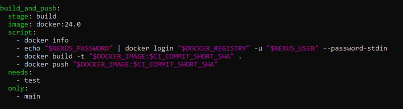

Пошаговое объяснение

1. **`stage: build`**

Job выполняется на этапе `build`, который идёт **после** этапа `test` (согласно определению `stages`).

2. **`image: docker:24.0`**

Runner запускает job внутри контейнера на основе официального образа **Docker CLI версии 24.0** **.**

3. **`script:` - последовательность команд**

* **`docker info`**
  Проверка подключения к Docker Engine. Команда выводит информацию о версии Docker, драйверах и состоянии - помогает при диагностике.
* **`echo "$NEXUS_PASSWORD" | docker login "$DOCKER_REGISTRY" -u "$NEXUS_USER" --password-stdin`**
  Безопасный вход в Docker-реестр (`nexus.local:5000`):
  * `$NEXUS_USER` и `$NEXUS_PASSWORD` - CI/CD-переменные, заданные в настройках проекта GitLab.
  * Используется `--password-stdin`, чтобы избежать отображения пароля в логах.
* **`docker build -t "$DOCKER_IMAGE:$CI_COMMIT_SHORT_SHA" .`**
  Сборка Docker-образа из `Dockerfile` в корне проекта.
  * Тег образа: `nexus.local:5000/python-lab:<короткий_хеш_коммита>`.
  * `$CI_COMMIT_SHORT_SHA` - встроенная переменная GitLab, содержащая 8 первых символов SHA текущего коммита (например, `a1b2c3d4`).
* **`docker push "$DOCKER_IMAGE:$CI_COMMIT_SHORT_SHA"`**
  Отправка собранного образа в репозиторий Nexus.

4. **`needs: [test]`**

Job `build_and_push` **зависит от успешного завершения job'а `test`** **.**
Если тесты упадут - сборка и публикация  **не запустятся** **.**

5. **`only: [main]`**

Job запускается **только при пуше в ветку `main`** **.**
Изменения в других ветках (например, `dev`, `feature`) не приведут к сборке и публикации образа.

После был создан простой Dockerfile :

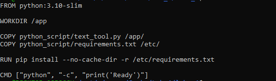

После этого были запушены изменения и выполнены тесты следующие скриншоты подтверждают успешный запуск и работу

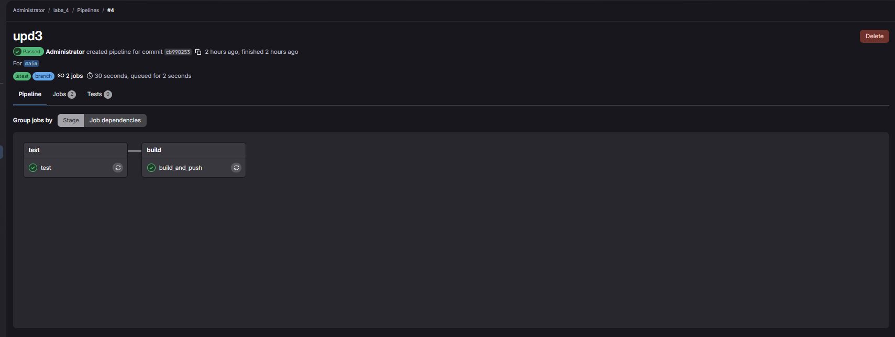

Также снизу прил агается скриншот с 	`Nexus`, на котором видно, что образ создан и лежит на `Nexus`.

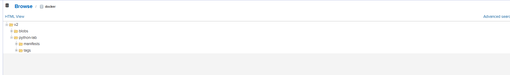

## Вывод по Задаче 3

Успешно настроен полный CI/CD-пайплайн: при пушgе в ветку `main` автоматически запускаются тесты, а при их успешном прохождении - собирается и публикуется Docker-образ в локальный репозиторий Nexus. Интеграция GitLab и Nexus работает корректно, что подтверждено скриншотами успешного пайплайна и появившегося образа в интерфейсе Nexus.
